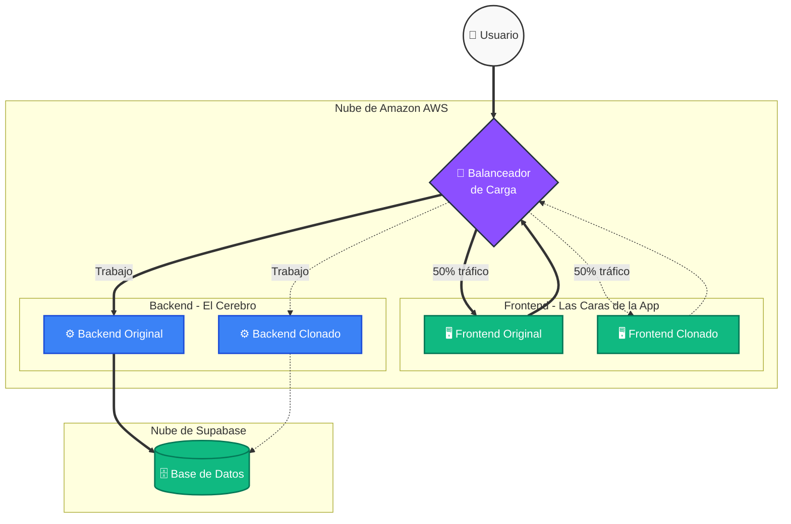

  <h1>🚀 Arquitectura Multi-Nube: Resiliencia y Auto Escalado</h1>
  
<i>Cómo construir una aplicación a prueba de caídas, explicada para humanos.</i>

---

## 🎯 El Problema y Nuestra Solución

Tradicionalmente, si subías tu página web a una computadora y esa computadora se apagaba o recibía demasiados visitantes, tu página **se caía por completo**. Nosotros hemos diseñado un sistema inteligente que se **auto-repara y clona a sí mismo** cuando detecta problemas, asegurando que el negocio nunca se detenga.

> [!IMPORTANT]
> El objetivo principal de esta arquitectura no es la aplicación de Clientes en sí, sino **demostrar que el sistema es capaz de sobrevivir a picos extremos de tráfico y fallos físicos** utilizando servicios de clase mundial como AWS (Amazon) y Supabase.

---

## 🗺️ Diagrama Visual: El Flujo de Trabajo

*Observa cómo el Balanceador actúa de "recepcionista", repartiendo el trabajo equitativamente entre los clones del sistema.*

---

## 🧩 ¿Quién hace qué? (Las 4 Piezas Clave)

Para entender esto fácil, imagina que nuestra aplicación es un gran **restaurante de lujo**:

1. **🔀 El Balanceador de Carga (Application Load Balancer):** Es el **Recepcionista**. Recibe a todos los clientes en la puerta y los reparte inteligentemente para que ningún camarero se llene de trabajo mientras otro no hace nada.
2. **🖥️ El Frontend (React):** Son los **Camareros**. Es la cara bonita del restaurante, interactúan con el cliente, les muestran el menú (la interfaz web) y toman sus pedidos.
3. **⚙️ El Backend (Django/Python):** Son los **Cocineros**. Están escondidos en la cocina haciendo el trabajo pesado. Validan que los ingredientes (datos) sean correctos y aplican la lógica estricta del negocio.
4. **🗄️ La Base de Datos (Supabase):** Es la **Despensa**. Es una bodega súper segura ubicada en otra instalación distinta (otra Nube) donde se guardan permanentemente los datos reales de los clientes.

---

## 🦸‍♂️ Los Súper Poderes de Nuestra Arquitectura

### 1. Auto-Clonación Inteligente (Auto Scaling)
Imagina que un famoso menciona tu página web en vivo por televisión y de pronto entran 10,000 personas de golpe.

> [!TIP]
> **¿Cómo lo resolvemos?**
> Tenemos "vigilantes virtuales" (AWS CloudWatch) midiendo el pulso de las computadoras. Si detectan que el procesador (CPU) de un servidor está sudando al **70% de su capacidad**, la Nube de Amazon **fabrica un clon exacto** en menos de 2 minutos. El Recepcionista (Balanceador) se da cuenta y empieza a mandarle visitantes al nuevo clon para aliviar el estrés. ¡Cuando la gente se va, el clon se destruye solo para ahorrarte dinero!

### 2. Inmunidad a Desastres (Zonas de Disponibilidad)
Los servidores físicos son máquinas de metal que pueden fallar por apagones, incendios o catástrofes naturales.

> [!WARNING]
> Para evitar que la página se caiga si ocurre un desastre, Amazon divide sus Nubes en diferentes **Zonas de Disponibilidad** físicas. Hemos configurado el sistema para que nuestro servidor original esté en un edificio (ej: `us-east-1a`) y el servidor clonado esté en un edificio totalmente distinto a millas de distancia (ej: `us-east-1b`). Si se va la electricidad en un edificio, el otro asume el 100% del trabajo y el usuario ni se entera.

### 3. Cero Mantenimiento (Serverless)
Hemos utilizado la tecnología de vanguardia **AWS ECS Fargate**. Esto significa que es una arquitectura "Sin Servidor". No tenemos que preocuparnos por instalar Windows, Linux, antivirus, ni actualizar parches de seguridad. Nosotros solo entregamos nuestro código y Amazon se encarga de administrar los servidores invisibles mágicamente.

---

## 📊 Panel de Control (Monitor en Tiempo Real)

Para demostrar que todo esto es real y no solo teoría, hemos programado un **Monitor de Estrés Interactivo** directamente en la aplicación.

* **¿Para qué sirve?** Al presionar el botón *"Iniciar Test"*, la aplicación empieza a bombardear a los servidores con peticiones, simulando tráfico intenso.
* **¿Qué verás?** Observarás en vivo y en directo unas barras de progreso azules y verdes que revelan el identificador único de AWS y la dirección IP Privada de cada contenedor. Podrás ver visualmente cómo el Balanceador de Carga está repartiendo el peso al 50/50, e incluso ver nacer un nuevo clon si mantienes el estrés lo suficiente.
