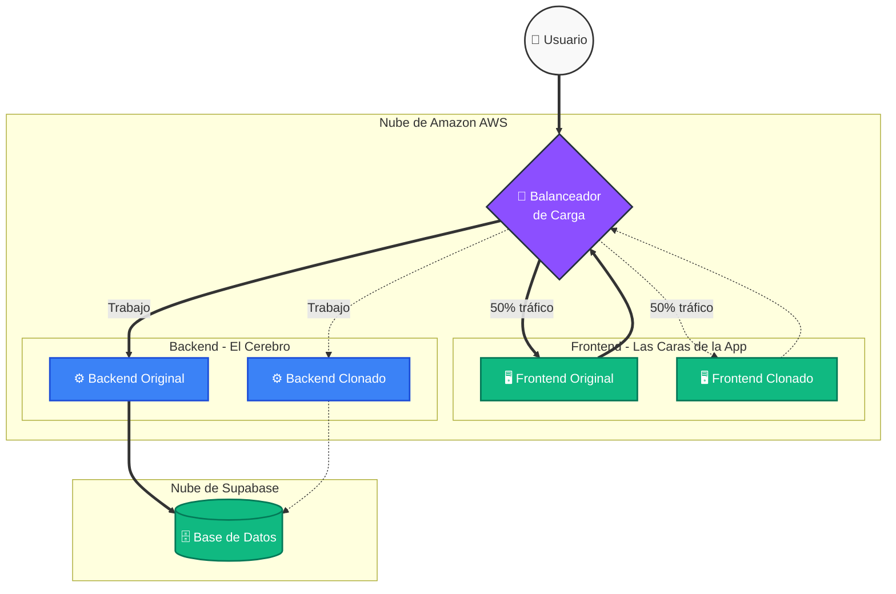

  <h1>Arquitectura Multi-cloud</h1>
  
<i>Aplicación a prueba de caídas.</i>

---

## El Problema y Mi Solución

Los servidores tradicionales se caen cuando reciben demasiado tráfico o sufren fallas. Para solucionar esto, **he diseñado** un sistema en la nube que se **auto-repara y clona a sí mismo** cuando detecta problemas, asegurando que la aplicación nunca se detenga.

> [!IMPORTANT]
> El objetivo principal de mi proyecto es **demostrar que el sistema es capaz de sobrevivir a picos extremos de tráfico y fallos físicos** utilizando servicios de AWS (Amazon) y Supabase.

---

## Diagrama Visual: El Flujo de Trabajo

*El Balanceador reparte el trabajo equitativamente entre los clones del sistema.*

---

## ¿Quién hace qué? (Las 4 Piezas Clave)

Para entender esto de forma simple, imagina que mi aplicación es un **restaurante**:

1. **🔀 El Balanceador de Carga:** Es el **Recepcionista**. Recibe a los clientes en la puerta y los reparte para que ningún camarero se llene de trabajo.
2. **🖥️ El Frontend (React):** Son los **Camareros**. Es la interfaz web, interactúa con el usuario y toma sus pedidos.
3. **⚙️ El Backend (Django/Python):** Son los **Cocineros**. Hacen el trabajo pesado, validan los datos y aplican la lógica del negocio.
4. **🗄️ La Base de Datos (Supabase):** Es la **Despensa**. Es la base de datos segura ubicada en otra nube donde se guardan los clientes.

---

## Los Súper Poderes de mi Arquitectura

### 1. Auto-Clonación Inteligente (Auto Scaling)
> [!TIP]
> Tengo "vigilantes virtuales" (AWS CloudWatch) midiendo los servidores. Si la CPU llega al **70%**, Amazon **fabrica un clon exacto** en menos de 2 minutos. El Balanceador empieza a mandarle visitantes al clon para aliviar el estrés. Cuando el tráfico baja, el clon se destruye para ahorrar costos.

### 2. Inmunidad a Desastres (Zonas de Disponibilidad)
> [!WARNING]
> Para evitar que la página se caiga si ocurre un desastre en un centro de datos, he configurado el sistema en diferentes **Zonas de Disponibilidad**. Mi servidor original está en un edificio (`us-east-1a`) y el servidor clonado está en otro (`us-east-1b`). Si se va la luz en uno, el otro asume el 100% del trabajo sin interrupciones.

### 3. Cero Mantenimiento (Serverless)
He utilizado **AWS ECS Fargate**, una arquitectura "Sin Servidor". No tengo que preocuparme por instalar sistemas operativos ni antivirus. Yo solo entrego el código y Amazon administra los servidores subyacentes.

---

## Panel de Control (Monitor en Tiempo Real)

He programado un **Monitor de Estrés Interactivo** en la aplicación para demostrar esto en vivo.

* **¿Para qué sirve?** Al presionar *"Iniciar Test"*, la app bombardea a los servidores con peticiones, simulando tráfico alto.
* **¿Qué verás?** Observarás en vivo unas barras de progreso que revelan el identificador único y la IP de cada contenedor. Verás cómo el Balanceador reparte el peso al 50/50, e incluso verás nacer un clon nuevo si el estrés continúa.
