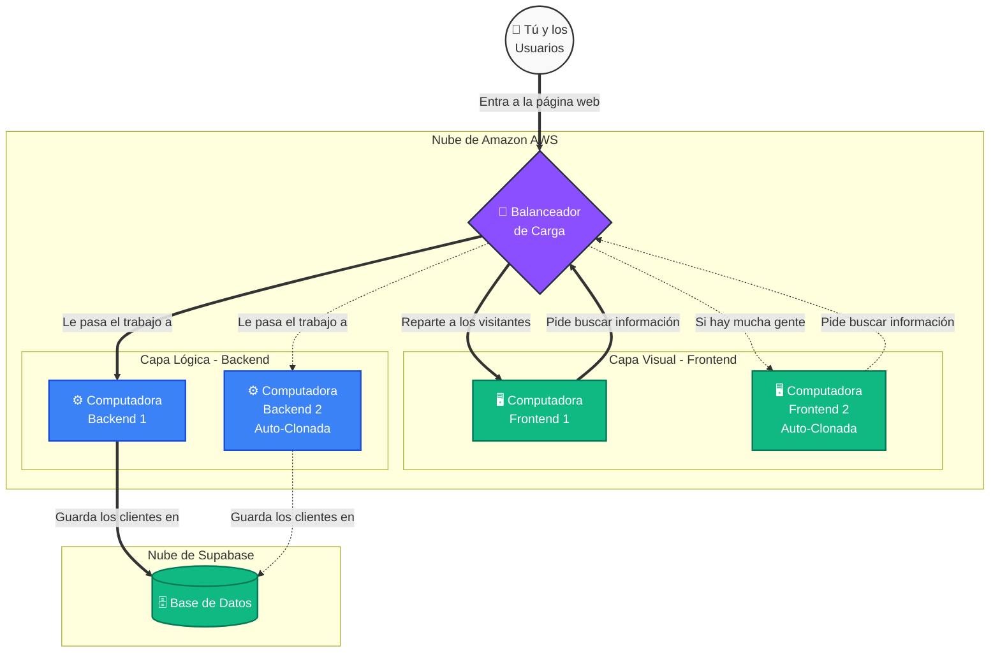

# 📚 Documentación del Proyecto: Aplicación Web Multi-Nube

¡Bienvenido a la documentación de nuestro sistema! Hemos construido una aplicación súper robusta, similar a cómo se diseñan las plataformas de las grandes empresas tecnológicas (como Netflix o Amazon), pero explicada de forma sencilla y fácil de entender.

---

## 🎯 ¿De qué trata el proyecto?
Es un sistema para gestionar clientes (crear, leer, actualizar y borrar). Lo especial de este proyecto **no es la aplicación en sí, sino dónde vive y cómo sobrevive a los problemas**. 

En lugar de tener una sola computadora (servidor) guardando todo, usamos dos gigantes de internet: **Amazon Web Services (AWS)** y **Supabase** (Multi-Nube) para asegurar que el sistema sea invencible y nunca se apague.

---

## 🗺️ Diagrama de la Arquitectura (Cómo funciona)

---

## 🧩 Las Piezas del Rompecabezas

### 1. El Director de Orquesta: El Balanceador de Carga
Imagínalo como el recepcionista de un restaurante muy concurrido. Cuando un cliente llega, el recepcionista mira qué camarero está más desocupado y se lo asigna. Si llega mucha gente de golpe, se encarga de repartir a los clientes en partes iguales (50% y 50%) para que ningún camarero colapse de estrés.

### 2. Los Camareros: El Frontend (React)
Son las "caras bonitas" del sistema. Son las pequeñas computadoras encargadas de dibujar los botones, colores y tablas en la pantalla de tu celular o PC. No hacen cálculos pesados, solo te muestran la información de manera elegante y toman tus órdenes.

### 3. Los Cocineros: El Backend (Django/Python)
Estos no se ven, pero hacen el trabajo pesado. Cuando tú guardas un nuevo cliente en la pantalla, el camarero (Frontend) le pasa el pedido al cocinero (Backend). El Backend revisa que los datos estén correctos, hace los cálculos de seguridad, y se va corriendo a guardarlos en la bodega.

### 4. La Bóveda Blindada: Supabase (Base de Datos)
Es la caja fuerte donde viven todos los datos reales (los nombres, teléfonos y estados de los clientes). No está en Amazon, sino en otra nube especializada, lo que llamamos una arquitectura **Multi-Nube**.

---

## 🚀 El Súper Poder: Auto-Clonación (Auto Scaling)

¿Qué pasa si tu página se hace famosa y entran miles de personas al mismo tiempo? En el pasado, la computadora se hubiese incendiado y la página web se habría caído mostrando la clásica pantalla blanca de error.

Con nuestro sistema, implementamos **magia de auto-preservación**:
1. Hay un "vigilante de seguridad" virtual mirando constantemente el corazón de las computadoras.
2. Si el vigilante nota que una computadora está sudando mucho (alcanza su límite de esfuerzo o "CPU"), hace sonar una alarma.
3. Automáticamente, la nube **clona (crea una copia exacta)** de tu computadora en menos de 3 minutos.
4. El Balanceador de Carga ve al nuevo clon e inmediatamente le empieza a enviar la mitad de los visitantes.
5. ¡Ambos clones respiran tranquilos y tu página nunca se cae!
6. Cuando los visitantes se van y ya no hay tráfico, AWS borra al clon automáticamente para **ahorrarte dinero**.

## 🛡️ Inmune a Desastres (Zonas de Disponibilidad)
En el mundo real, los edificios de servidores pueden quedarse sin electricidad o incendiarse. Nosotros configuramos la aplicación para que funcione en dos "Zonas" separadas (`us-east-1a` y `us-east-1b`). Esto significa que la computadora original y su clon están físicamente en **ciudades o edificios distintos**. Si cae un rayo en un edificio, el otro asume todo el trabajo en un milisegundo y el usuario nunca se entera del accidente.

## 📊 El Monitor de Estrés Visual
Hemos integrado un monitor interactivo al final de nuestra página web. Al presionar "Iniciar Test", enviamos un ataque simulado de cientos de clicks por minuto. Esto te permite observar visualmente, mediante barras de progreso azules y verdes, cómo nace una nueva computadora clonada y cómo el Balanceador de Carga empieza a repartir mágicamente el peso entre las dos.
